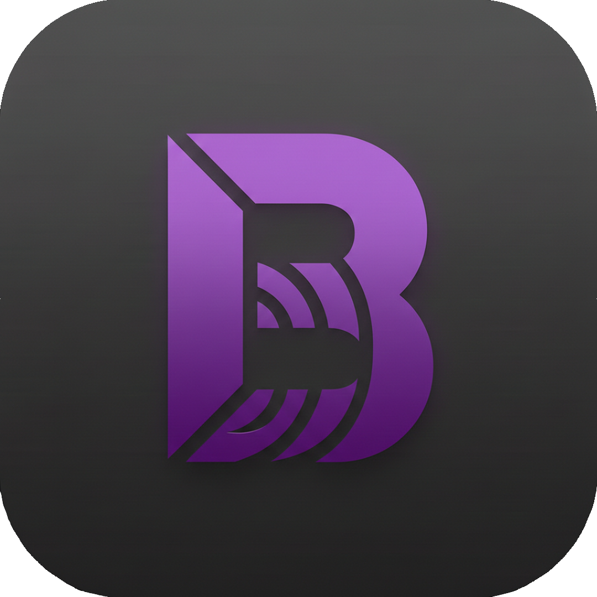

# BitBeat 🎵

BitBeat is a premium, minimalist desktop music player built with **Electron**, **Tailwind CSS**, and modern web technologies. Designed for a sleek and distraction-free listening experience, it lets you enjoy your local music library with style.



## ✨ Features

-   **Local Library Management**: Easy access to your local music folders.
-   **Seamless Playback**: High-quality audio playback for various formats (MP3, WAV, M4A, OGG, FLAC, etc.).
-   **Custom Playlists**: Create and manage your own music collections.
-   **Liked Songs**: Quick access to your favorite tracks with one-click liking.
-   **Modern UI**: Beautiful, dark-themed interface with smooth animations and responsive design.
-   **Cross-Platform**: Built for Windows and Linux (Arch, Debian, RPM, AppImage).

## 🚀 Getting Started

### Prerequisites

-   [Node.js](https://nodejs.org/) (v20 or higher recommended)
-   [npm](https://www.npmjs.com/) or [Bun](https://bun.sh/)

### Installation

1.  Clone the repository:
    ```bash
    git clone https://github.com/ntureyc/BitBeat.git
    cd BitBeat
    ```
2.  Install dependencies:
    ```bash
    npm install
    ```

### Usage

To start the application in development mode:
```bash
npm start
```

### Building for Production

To package the application for your platform:

-   **Linux**: `npm run build:linux` (Targets: AppImage, deb, rpm, pacman)
-   **Windows**: `npm run build:win` (Targets: NSIS)
-   **All Platforms**: `npm run build:all`

> [!NOTE]
> Building for Linux on Arch requires `libxcrypt-compat` and `rpm-tools`.

## 🛠 To-Do List (Future Features)

-   [ ] **Filters**: Filter songs by genre, artist, or album.
-   [ ] **Shuffle**: Randomized playback for your tracks.
-   [ ] **Loop**: Repeat your favorite songs or playlists.
-   [ ] **Theme Support**: Customizable color schemes.
-   [ ] **Audio Visualizers**: Real-time visual feedback for your music.
-   [ ] **Last.fm Scrobbling**: Sync your listening habits.

## 📜 License

This project is licensed under the MIT License - see the [LICENSE](LICENSE) file for details.

---

**Made by Ntureyc**
